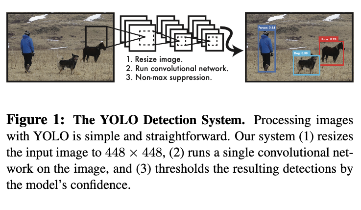

# You Only Look Once:
Unified, Real-Time Object Detection

Author: Joseph Redmon, Santosh Divvala, Ross Girshick, Ali Farhadi
Journal: Computer Vision and Pattern Recognition
PDF: YOLOv1/YOLOv1.pdf
Published Date: 2016년 5월 9일
keyword: Object Detection
link: https://arxiv.org/pdf/1506.02640.pdf
status: Reading

# Abstract

*We present YOLO, a new approach to object detection. Prior work on object detection repurposes classifiers to perform detection.*

W*e frame object detection as a regression problem to spatially separated bounding boxes and associated class probabilities.*

*A single neural network predicts bounding boxes and class probabilities directly from full images in one evaluation.*

I*t can be optimized end-to-end directly on detection performance.*

*Our unified architecture is extremely fast. Our base YOLO model processes images in real-time at 45 frames per second.*

*Fast YOLO, processes an astounding 155 frames per second while still achieving double the mAP of other real-time detecors.*

*YOLO makes more localization errors but is less likely to predict false positives on background.*

*It outperforms other detection methods, including DPM and R-CNN.*

# 1. Introduction

The human visual system is fast and accurate, allowing us to perform complex tasks like driving with little conscious thought.

Fast, accurate algorithms for object detection would allow computers to drive cars without specialized sensors.

Current detection systems repurpose classifiers to perform detection.

Systems like deformable parts models (DPM) use a sliding window approach where the classifier is run at evenly spaced locations over the entire image.

More recent approaches like R-CNN use region proposal methods to first generate potential bounding boxes in an image and then run a classifier on these proposed boxes.

These complex pipelines are slow and hard to optimize because each individual component must be trained separately.

We reframe object detection as a single regression problem, straight from image pixels to bounding box coordinates and class probabilities.

YOLO is refreshingly simple.

First, YOLO is extremely fast. Since we frame detection as a regression problem we don’t need a complex pipeline.

Second, YOLO reasons globally about the image when making predictions.

Unlike sliding window and region proposal-based techniques, YOLO sees the entire image during training and test time so it implicitly encodes contextual information about classes as well as their appearance.

YOLO makes less than half the number of background errors compared to Fast R-CNN.

Third, YOLO learns generalizable representations of objects. 

Since YOLO is highly generalizable it is less likely to break down when applied to new domains or unexpected inputs.

YOLO still lags behind state-of-the-art detection systems in accuracy.

While it can quickly identify objects in images it struggles to precisely localize some objects, especially small ones.

# 2. Unified Detection

We unify the separate components of object detection into a single neural network. Our network uses features from the entire image to predict each bounding box.

This means our network reasons globally about the full image and all the objects in the image.

The YOLO design enables end-to-end training and realtime speeds while maintaining high average precision.

Our system divides the input image into an S x S grid.

Each grid cell predicts B bounding boxes and confidence scores for those boxes.

These confidence scores reflect how confident the model is that the box contains an object and
also how accurate it thinks the box is that it predicts.

we define confidence as Pr(Object) ∗ IOUtruth/pred.

Otherwise we want the confidence score to equal the intersection over union (IOU) between the predicted box and the ground truth.

Each bounding box consists of 5 predictions: x, y, w, h, and confidence. 

The (x, y) coordinates represent the center of the box relative to the bounds of the grid cell. The width
and height are predicted relative to the whole image. Finally the confidence prediction represents the IOU between the predicted box and any ground truth box.

Each grid cell also predicts C conditional class probabilities, Pr(Classi|Object).

We only predict one set of class probabilities per grid cell, regardless of the
number of boxes B.

At test time we multiply the conditional class probabilities and the individual box confidence predictions

These scores encode both the probability of that class appearing in the box and how well the predicted box fits the object.

# 2.1. Network Design

We implement this model as a convolutional neural network and evaluate it on the PASCAL VOC detection dataset.

fully connected layers predict the output probabilities and coordinates.

Our network architecture is inspired by the GoogLeNet model for image classification.

Our network has 24 convolutional layers followed by 2 fully connected layers.

we simply use 1 x 1 reduction layers followed by 3 x 3 convolutional layers, similar to Lin et al.

Fast YOLO uses a neural network with fewer convolutional layers (9 instead of 24)

# 2.2. Training

We pretrain our convolutional layers on the ImageNet 1000-class competition dataset.

For pretraining we use the first 20 convolutional layers from Figure 3 followed by a average-pooling layer and a fully connected layer.

We use the Darknet framework for all training and inference.

we add four convolutional layers and two fully connected layers with randomly initialized weights.

Detection often requires fine-grained visual information so we increase the input resolution of the network
from 224 x 224 to 448 x 448.

Our final layer predicts both class probabilities and bounding box coordinates.

We use a linear activation function for the final layer and all other layers use the following leaky rectified linear activation:

We optimize for sum-squared error in the output of our model.

We use sum-squared error because it is easy to optimize, however it does not perfectly align with our goal of maximizing average precision.

This can lead to model instability, causing training to diverge early on.

we increase the loss from bounding box coordinate predictions and decrease the loss from confidence predictions for boxes that don’t contain objects.

Our error metric should reflect that small deviations in large boxes matter less than in small boxes.

we predict the square root of the bounding box width and height instead of the width and height directly.

YOLO predicts multiple bounding boxes per grid cell.

prediction has the highest current IOU with the ground truth. 

This leads to specialization between the bounding box predictors.

Our learning rate schedule is as follows: For the first epochs we slowly raise the learning rate from 10^-3 to 10^-2. 

If we start at a high learning rate our model often diverges due to unstable gradients.

To avoid overfitting we use dropout and extensive data augmentation.

For data augmentation we introduce random scaling and translations of up to 20% of the original image size.

# 2.3. Inference

Just like in training, predicting detections for a test image only requires one network evaluation.

YOLO is extremely fast at test time since it only requires a single network evaluation, unlike classifier-based methods.

Network only predicts one box for each object.

Non-maximal suppression can be used to fix these multiple detections.

# 2.4. Limitations of YOLO

YOLO imposes strong spatial constraints on bounding box predictions since each grid cell only predicts two boxes and can only have one class.

Our model struggles with small objects that appear in groups, such as flocks of birds.

Since our model learns to predict bounding boxes from data, it struggles to generalize to objects in new or unusual aspect ratios or configurations.

our loss function treats errors the same in small bounding boxes versus large bounding boxes.

small error in a small box has a much greater effect on IOU.

Our main source of error is incorrect localizations.

# 3. Comparison to Other Detection Systems

We compare the YOLO detection system to several top detection frameworks, highlighting key similarities and differences

### Deformable parts models

sliding window approach to object detection

### R-CNN

its variants use region proposals instead of sliding windows to find objects in images.

### Other Fast Detectors

Fast and Faster R-CNN focus on speeding up the R-CNN framework by sharing computation and using neural networks to propose regions instead of Selective Search.

# 4. Experiments

We also present VOC 2012 results and compare mAP to current state-of-the-art methods.

YOLO generalizes to new domains better than other detectors on two artwork datasets.

YOLO struggles to localize objects correctly. Localization errors account for more of YOLO’s errors than all other sources combined. Fast R-CNN makes much fewer localization errors but far more background errors. 13.6% of it’s top detections are false positives that don’t contain any objects.

# 6. Conclusion

YOLO also generalizes well to new domains making it ideal for applications that rely on fast, robust object detection
